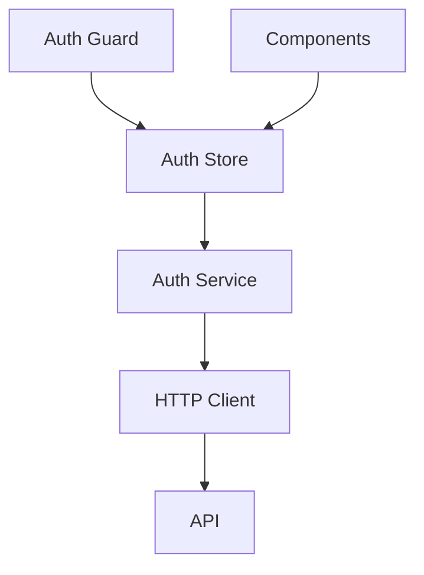
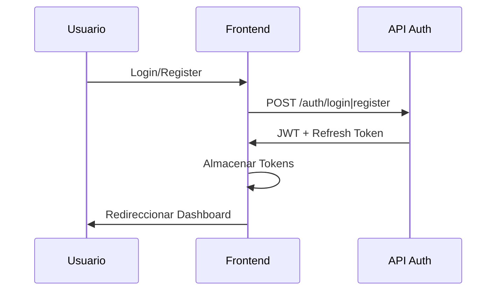

# ADR 006: Arquitectura de Autenticación

## Estado
Aceptado

Fecha: 23/05/2025
Autor: Roo

## Contexto
El sistema requiere una capa de autenticación robusta para proteger el acceso al backoffice. Los usuarios necesitan poder iniciar sesión, cerrar sesión y registrarse. La autenticación debe ser persistente entre sesiones y manejar la renovación de tokens.

## Decisión
Implementaremos un sistema de autenticación basado en JWT (JSON Web Tokens) con las siguientes características:

1. **Gestión de Tokens**:
   - Access Token (JWT) para autenticación de requests
   - Refresh Token para renovación automática
   - Almacenamiento seguro en localStorage con encriptación

2. **Arquitectura de Autenticación**:

3. **Componentes principales**:
   - `AuthStore`: Estado global de autenticación
   - `AuthService`: Lógica de negocio de autenticación
   - `HttpClient`: Interceptor para inyectar tokens
   - `AuthGuard`: Protección de rutas

4. **Flujo de Autenticación**:

## Consecuencias

### Positivas
- Autenticación stateless y escalable
- Renovación automática de sesiones
- Separación clara de responsabilidades
- Protección consistente de rutas

### Negativas
- Complejidad adicional en manejo de tokens
- Necesidad de sincronización de estados

## Consideraciones de Seguridad
1. Los tokens se almacenarán encriptados
2. Implementar protección XSS y CSRF
3. Validación de tokens en cada request
4. Rotación segura de refresh tokens

## Implementación

1. **Infraestructura Base**:
   - Composable `useAuth` para lógica de autenticación
   - Configuración HTTP centralizada en `/config/http.ts`
   - Interceptor HTTP en cliente con renovación automática
   - Guard de autenticación para protección de rutas

2. **Flujos de Usuario**:
   - Login: Validación y almacenamiento de tokens
   - Registro: Validación y login automático
   - Logout: Limpieza de tokens y redirección
   - Renovación automática de tokens cuando expiran

3. **Testing**:
   - Unit tests para `useAuth` y encriptación de tokens
   - Integration tests para HTTP client y renovación
   - E2E tests para flujos completos de autenticación
   
4. **Seguridad**:
   - Encriptación de tokens en localStorage
   - CSRF tokens en headers
   - Manejo de errores con mensajes amigables
   - Validación de campos sensibles

## Estado de Implementación

- **Completado** ✅:
  - Infraestructura base de autenticación
  - Componentes de login/registro
  - Protección de rutas
  - Tests unitarios y E2E
  
- **Pendiente** 🚧:
  - Implementar encriptación real de tokens
  - Mejorar manejo de errores específicos
  - Aumentar cobertura de tests

## Referencias
- [OpenAPI Spec](/docs/api/openapi.json) - Endpoints de autenticación
- [Vue Router Guards](https://router.vuejs.org/guide/advanced/navigation-guards.html)
- [JWT Best Practices](https://datatracker.ietf.org/doc/html/rfc7519#section-4)
- [OWASP Session Management Cheat Sheet](https://cheatsheetseries.owasp.org/cheatsheets/Session_Management_Cheat_Sheet.html)
