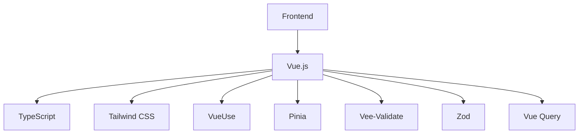
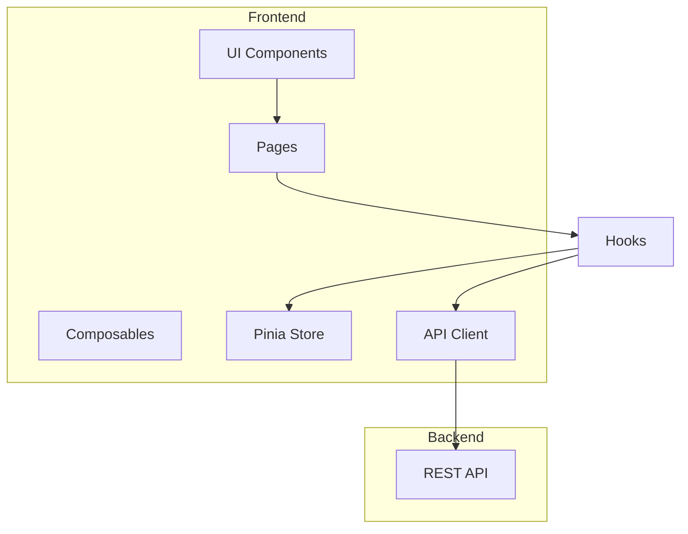

# Backoffice Implementation Plan

## Objetivo
Crear una aplicación web que permita gestionar de manera eficiente los artículos y libros del blog, consumiendo la API REST existente.

## Tecnologías Propuestas


- **Vue 3**: Framework progresivo con Composition API
- **TypeScript**: Tipado estático y mejor DX
- **Tailwind CSS**: Estilado rápido y consistente
- **VueUse**: Colección de composables útiles
- **Pinia**: Gestión de estado simple y efectiva
- **Vee-Validate**: Manejo de formularios con validación
- **Zod**: Validación de esquemas y tipado
- **Vue Query**: Gestión de estado del servidor y caché

## Arquitectura



## Funcionalidades

### 1. Dashboard
- Vista general de estadísticas
  * Número total de artículos
  * Número total de libros
  * Últimos artículos creados
  * Últimos libros añadidos

### 2. Gestión de Artículos
- Listado paginado con búsqueda
- Creación de artículos
  * Generación de UUID v4 en cliente
  * Editor de markdown para contenido
  * Selector múltiple de libros relacionados
- Edición de artículos
- Eliminación de artículos
- Vista previa

### 3. Gestión de Libros
- Listado paginado con búsqueda
- Creación de libros
  * Generación de UUID v4 en cliente
  * Validación de ISBN
  * Upload de imágenes (futura feature)
- Edición de libros
- Eliminación de libros
- Vista de artículos relacionados

### 4. Características Globales
- Tema claro/oscuro
- Layout responsive
- Mensajes de feedback
- Manejo de errores
- Confirmación para acciones destructivas
- Breadcrumbs

## User Interface

### Estructura de Navegación
```typescript
// router/index.ts
import { createRouter, createWebHistory } from 'vue-router';

export const router = createRouter({
  history: createWebHistory(),
  routes: [
    {
      path: '/dashboard',
      component: () => import('@/views/DashboardView.vue')
    },
    {
      path: '/articles',
      component: () => import('@/views/articles/ArticlesLayout.vue'),
      children: [
        {
          path: '',
          component: () => import('@/views/articles/ArticlesList.vue')
        },
        {
          path: 'new',
          component: () => import('@/views/articles/ArticleForm.vue')
        },
        {
          path: ':id/edit',
          component: () => import('@/views/articles/ArticleForm.vue'),
          props: true
        },
        {
          path: ':id',
          component: () => import('@/views/articles/ArticleDetails.vue'),
          props: true
        }
      ]
    },
    // Similar structure for books...
  ]
});
```

### Componentes Core
1. **Layout**
   ```vue
   <!-- App.vue -->
   <template>
     <div class="layout">
       <TheSidebar />
       <main>
         <TheHeader />
         <router-view />
         <TheFooter />
       </main>
     </div>
   </template>
   ```

2. **DataGrid**
   - Ordenamiento
   - Filtrado
   - Paginación
   - Acciones por fila

3. **Forms**
   - Input validación
   - Error handling
   - Loading states
   - Auto-save (opcional)

4. **Feedback**
   - Toast notifications
   - Loading spinners
   - Error boundaries
   - Empty states

## Integración API

### Cliente HTTP
```typescript
// composables/api/useArticles.ts
export function useArticles() {
  const queryClient = useQueryClient();

  return {
    list: useQuery(['articles'],
      (params: PaginationParams) => api.get('/backoffice/articles', { params }),
      { keepPreviousData: true }
    ),
    
    get: useQuery(['article'],
      (id: string) => api.get(`/backoffice/articles/${id}`),
    ),
    
    create: useMutation(
      (data: CreateArticleDto) => api.post('/backoffice/articles', data),
      {
        onSuccess: () => {
          queryClient.invalidateQueries(['articles']);
        }
      }
    ),
    
    update: useMutation(
      ({ id, data }: { id: string; data: UpdateArticleDto }) =>
        api.put(`/backoffice/articles/${id}`, data),
      {
        onSuccess: () => {
          queryClient.invalidateQueries(['articles']);
        }
      }
    ),
    
    delete: useMutation(
      (id: string) => api.delete(`/backoffice/articles/${id}`),
      {
        onSuccess: () => {
          queryClient.invalidateQueries(['articles']);
        }
      }
    )
  };
}

// Similar structure for useBooks...
```

### Estructura del Proyecto
```
├── src/
│   ├── assets/            # Estáticos (imágenes, etc)
│   ├── components/        # Componentes reutilizables
│   │   ├── ui/           # Componentes base (Button, Input, etc)
│   │   ├── articles/     # Componentes específicos de artículos
│   │   └── books/        # Componentes específicos de libros
│   ├── composables/       # Composables reutilizables
│   │   ├── api/          # Composables de API
│   │   └── ui/           # Composables de UI
│   ├── router/           # Configuración de rutas
│   ├── stores/           # Stores Pinia
│   ├── types/            # Tipos TypeScript
│   ├── utils/            # Utilidades
│   ├── views/            # Componentes de página
│   │   ├── dashboard/
│   │   ├── articles/
│   │   └── books/
│   ├── App.vue           # Componente raíz
│   └── main.ts           # Punto de entrada
├── tests/
│   ├── unit/            # Tests unitarios
│   └── e2e/             # Tests E2E
├── index.html
├── package.json
├── tsconfig.json
├── vite.config.ts
└── tailwind.config.js
```

### Estado Global
```typescript
// stores/app.ts
import { defineStore } from 'pinia';

export const useAppStore = defineStore('app', {
  state: () => ({
    theme: 'light' as 'light' | 'dark',
    sidebar: {
      isOpen: true
    },
    notifications: [] as Notification[]
  }),
  
  actions: {
    toggleSidebar() {
      this.sidebar.isOpen = !this.sidebar.isOpen;
    },
    addNotification(notification: Notification) {
      this.notifications.push(notification);
    },
    removeNotification(id: string) {
      this.notifications = this.notifications.filter(n => n.id !== id);
    }
  }
});
```

## Testing Strategy

1. **Unit Tests** (Vitest)
   - Componentes individuales con Vue Test Utils
   - Composables
   - Stores Pinia
   - Utilidades

2. **Integration Tests**
   - Flujos de formularios
   - Interacción API
   - Estado global

3. **E2E Tests**
   - Flujos críticos
   - CRUD artículos
   - CRUD libros

## Plan de Implementación

### Fase 1: Setup y Estructura
1. Inicialización proyecto Vue con Vite
2. Configuración TypeScript
3. Integración Tailwind
4. Setup testing con Vitest

### Fase 2: Core Features
1. Layout base
2. Cliente API
3. Gestión estado
4. Componentes base

### Fase 3: CRUD Artículos
1. Listado
2. Creación
3. Edición
4. Eliminación

### Fase 4: CRUD Libros
1. Listado
2. Creación
3. Edición
4. Eliminación

### Fase 5: Features Adicionales
1. Dashboard
2. Búsqueda
3. Tema oscuro
4. Optimizaciones

## Prompt para Implementación

```
Necesito crear un backoffice para gestionar artículos y libros de un blog, con las siguientes especificaciones:

Tecnologías:
- Vue 3 con Composition API
- TypeScript
- Tailwind CSS
- Vue Query
- Pinia
- Vee-Validate
- Zod

Funcionalidades principales:
1. Dashboard con estadísticas básicas
2. CRUD completo de artículos con:
   - Listado paginado y búsqueda
   - Creación con UUID v4 en cliente
   - Editor markdown
   - Selección de libros relacionados
3. CRUD completo de libros con:
   - Listado paginado y búsqueda
   - Validación de ISBN
   - Gestión de relaciones con artículos
4. Tema claro/oscuro
5. Layout responsive
6. Manejo de errores y feedback

La API backend ya está implementada con endpoints RESTful para todas las operaciones necesarias.

Por favor, comienza con la estructura base del proyecto usando Vue 3 + Vite y el layout principal.
```

## Criterios de Aceptación

1. **Funcionalidad**
   - CRUD completo de artículos y libros
   - Navegación fluida
   - Manejo correcto de errores

2. **UI/UX**
   - Diseño responsive
   - Feedback claro de acciones
   - Tiempos de carga óptimos

3. **Código**
   - TypeScript strict mode
   - Tests importantes
   - Documentación clara

4. **Performance**
   - Lighthouse score > 90
   - FCP < 1.5s
   - TTI < 3.5s
